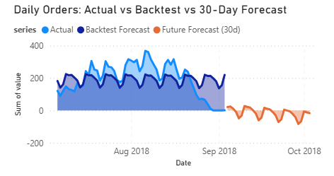

# Retail AI Demand Forecasting (SARIMAX vs LSTM) + Power BI Dashboard

The complete demand forecasting project utilized **SQLite and SQL views** together with **Python time-series modeling** and produced an **interactive Power BI dashboard**.

## Key Features
- Built an analytics mart in **SQLite** using SQL views (daily orders, revenue, state, and category rollups).
- Implemented and benchmarked:
  - **SARIMAX** baseline model
  - **LSTM** deep learning model
- Performed **60-day backtesting** with MAE/RMSE evaluation.
- Generated a **30-day forward demand forecast**.
- Extended forecasting to **Top-5 product categories** for demand planning.

## Results (Backtest)
- SARIMAX: MAE ≈ 79.61, RMSE ≈ 94.53  
- LSTM: MAE ≈ 57.51, RMSE ≈ 67.58  

## Dashboard Screenshots

## Repo Structure
- `dashboard/` Power BI `.pbix`
- `scripts/` Python forecasting scripts
- `sql/` SQL views for analytics mart
- `images/` dashboard screenshots

## How to Run (High Level)
1. Load Olist CSVs into SQLite.
2. Run SQL in `sql/01_views_mart.sql` to create views.
3. Run scripts in `scripts/` to generate forecast CSVs.
4. Open `dashboard/*.pbix` in Power BI Desktop.

## Dataset
The Olist Brazilian E-Commerce dataset is available from Kaggle.
